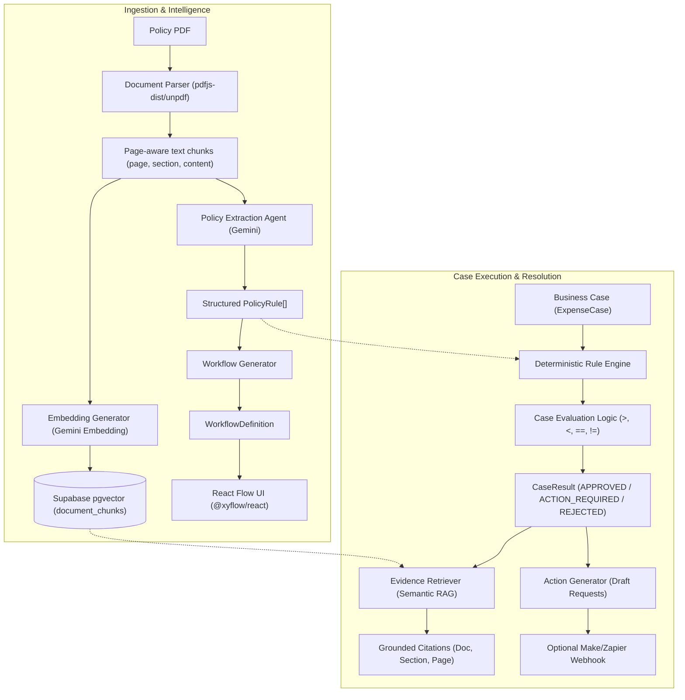

# RulePilot AI — System Architecture & Technical Design

This describes the target MVP. Current implementation: root Next.js app, static fixtures, partial engine and HTTP 501 scaffolds. Parsing, embeddings, RAG and persistence are not implemented.

## 1. System Overview
RulePilot AI transforms static, passive company policies (PDFs/SOPs) into active, executable business workflows with grounded document citations.

---

## 2. Core Architecture Pipeline

---

## 3. Core Architectural Principle

> [!IMPORTANT]
> **LLM = Interpret natural-language policy.**
> **Deterministic application code = Execute structured rules wherever possible.**

### Why this division matters:
1. Deterministic comparisons are repeatable; extracted rules and citations still require validation.
2. **Explainability & Auditability:** Regulated enterprise compliance (finance, HR, procurement) demands mathematically verifiable decisions backed by page citations.
3. Local comparisons need no LLM call. Performance has not been benchmarked.

---

## 4. Subsystem Breakdown

### 4.1. Document Parser & Chunking
- Preserves page numbers and section headers.
- Stores text chunks in `document_chunks` table with `vector(768)` embeddings for semantic lookup.

### 4.2. Policy Extraction Agent
- Sends policy text chunks to Gemini with a strict JSON schema.
- Emits standard `PolicyRule[]` defining `field`, `operator`, `value`, `action`, and citation metadata.

### 4.3. Visual Workflow Generation
- Converts `PolicyRule[]` into `WorkflowDefinition` (nodes: `start`, `condition`, `action`, `approval`, `end`).
- Rendered interactively using `@xyflow/react`.

### 4.4. Deterministic Rule Engine
- Evaluates `ExpenseCase` fields:
  - `amount > 5000` && `!receipt` → Violation: `EXP-001`
  - `amount > 50000` && `!managerApproval` → Violation: `EXP-002`
  - `amount > 100000` && `!financeApproval` → Violation: `EXP-003`
  - `internationalTravel` && `!preApproval` → Violation: `EXP-006`
  - Submission timeliness `<= 14 days`.
- Supports multiple simultaneous violations.

### 4.5. Action & Webhook Dispatcher
- Generates approval drafts, notification emails, and missing document notices.
- Webhook trigger to Make or Zapier is completely non-blocking and optional.

## Integration boundaries

Member 1 owns API adapters and persistence. Member 2 supplies document/AI/rule functions; Member 4 renders WorkflowDefinition and owns optional automation. See types/api.ts for HTTP envelopes. Execution links workflowId to its document and rules; action generation links caseId to stored input and results. A browser cannot choose authoritative rules or decisions.

Citation.page is a one-based PDF page; Citation.text must match source content. Citation has no documentId, so preserve document/workflow/case relationships through the API and database. RAG queries must supply the current document ID. Missing evidence is unresolved, not an invented quote.

The existing engine covers EXP-001/002/003/006 only and ignores generic operators. EXP-004/005, validation and unsupported-rule rejection are Member 2 work. Hotel fields are agreed in ADR-008; missing hotel rate must be rejected for hotel claims before evaluation. The mock workflow covers three thresholds and is not a complete six-rule execution graph.

Do not await optional webhook delivery in the decision path. The existing webhook helper is disconnected and has not been live-tested; Member 4 must add a bounded timeout and failure tests before use.
