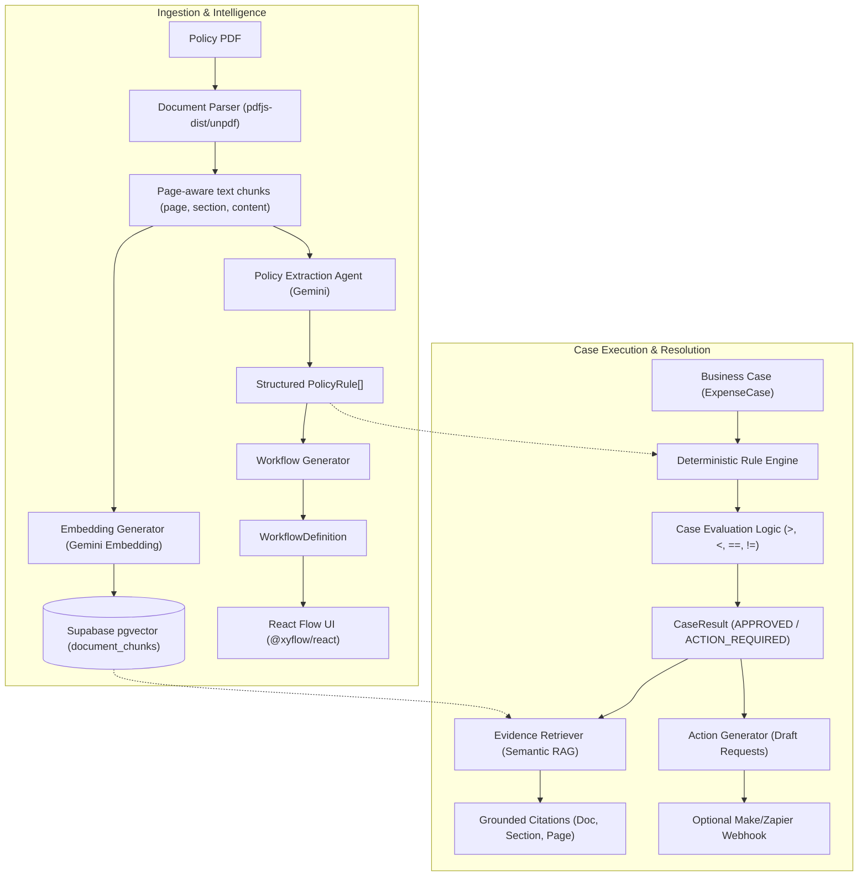

# RulePilot AI — System Architecture & Technical Design

## 1. System Overview
RulePilot AI transforms static, passive company policies (PDFs/SOPs) into active, executable business workflows with grounded document citations.

---

## 2. Core Architecture Pipeline

---

## 3. Core Architectural Principle

> [!IMPORTANT]
> **LLM = Interpret natural-language policy.**
> **Deterministic application code = Execute structured rules wherever possible.**

### Why this division matters:
1. **Zero Hallucination in Decisions:** An LLM may miscalculate numbers, misunderstand date ranges, or inconsistently evaluate edge cases. Deterministic JavaScript code (`lib/rules/engine.ts`) guarantees that `amount > 50000` evaluates identically 100% of the time.
2. **Explainability & Auditability:** Regulated enterprise compliance (finance, HR, procurement) demands mathematically verifiable decisions backed by page citations.
3. **Speed & Reliability:** Evaluating a deterministic JSON rule takes less than 1 millisecond and requires zero token cost or network round-trips.

---

## 4. Subsystem Breakdown

### 4.1. Document Parser & Chunking
- Preserves page numbers and section headers.
- Stores text chunks in `document_chunks` table with `vector(768)` embeddings for semantic lookup.

### 4.2. Policy Extraction Agent
- Sends policy text chunks to Gemini with a strict JSON schema.
- Emits standard `PolicyRule[]` defining `field`, `operator`, `value`, `action`, and citation metadata.

### 4.3. Visual Workflow Generation
- Converts `PolicyRule[]` into `WorkflowDefinition` (nodes: `start`, `condition`, `action`, `approval`, `end`).
- Rendered interactively using `@xyflow/react`.

### 4.4. Deterministic Rule Engine
- Evaluates `ExpenseCase` fields:
  - `amount > 5000` && `!receipt` → Violation: `EXP-001`
  - `amount > 50000` && `!managerApproval` → Violation: `EXP-002`
  - `amount > 100000` && `!financeApproval` → Violation: `EXP-003`
  - `internationalTravel` && `!preApproval` → Violation: `EXP-006`
  - Submission timeliness `<= 14 days`.
- Supports multiple simultaneous violations.

### 4.5. Action & Webhook Dispatcher
- Generates approval drafts, notification emails, and missing document notices.
- Webhook trigger to Make or Zapier is completely non-blocking and optional.
